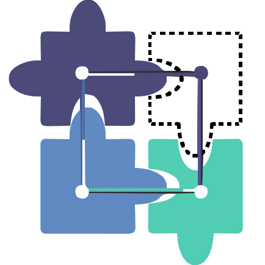
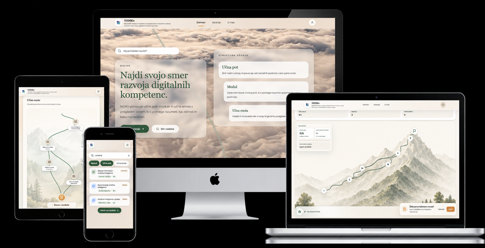
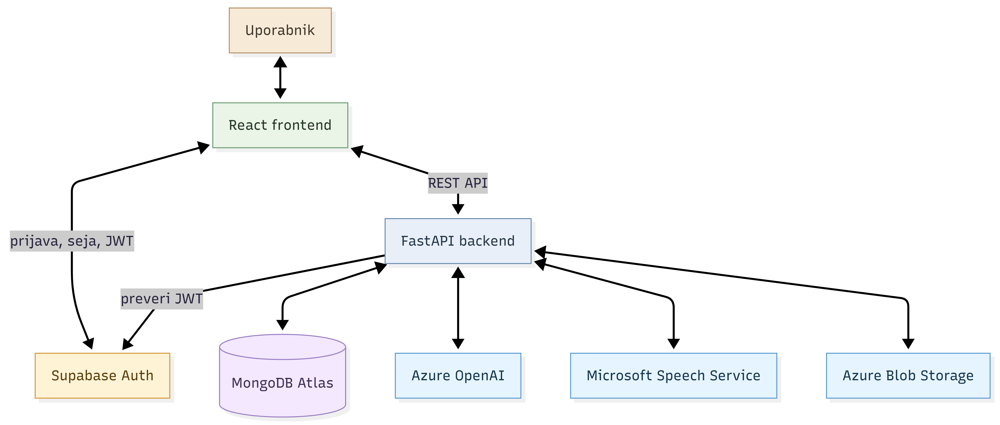

<p align="center">
  
</p>

<h1 align="center">NIDiKo</h1>

<p align="center">
  Spletna aplikacija za usmerjanje uporabnikov pri razvoju digitalnih kompetenc.
</p>

<p align="center">
  <a href="#vizija-in-namen-projekta">
    
  </a>
  <a href="#funkcionalnosti">
    
  </a>
  <a href="#zaslonski-prikazi">
    
  </a>
  <a href="#namestitev-in-lokalni-zagon">
    
  </a>
  <a href="#tehnoloski-sklad">
    
  </a>
  <a href="#arhitektura">
    
  </a>
  <a href="#struktura-projekta">
    
  </a>
  <a href="#delujoca-resitev">
    
  </a>
  <a href="#dokumentacija">
    
  </a>
</p>

---

## Vizija in namen projekta

Vizija projekta je razviti pregleden in uporabniku prijazen priporočilni sistem, ki posamezniku pomaga izbrati ustrezno učno pot za razvoj digitalnih kompetenc. NIDiKo uporabnika vodi od začetne samoocene do priporočene učne poti, sestavljene iz modulov in učnih enot.

Rešitev naslavlja problem nepreglednosti pri izbiri izobraževalnih vsebin. Namesto ročnega iskanja posameznih učnih enot sistem predlaga smiselno pot, ki upošteva uporabnikovo izhodiščno znanje, cilje in odgovore v vprašalniku.

Sistem je namenjen študentom, zaposlenim, profesorjem, starejšim uporabnikom, podjetjem in posameznikom brez osnovnega digitalnega znanja, ki želijo razvijati digitalne kompetence ali lažje izbrati ustrezno učno smer.

Podrobnejši opis projekta je zapisan v dokumentu [Pregled projekta](docs/01-pregled-projekta.md).
<a id="funkcionalnosti"></a>

## Ključne funkcionalnosti

- strukturiran pregled učnih poti, modulov in učnih enot,
- samoocenjevalni vprašalnik za določanje izhodiščnega znanja,
- glasovna pomoč pri vprašalniku za bolj dostopno in uporabniku prijazno izpolnjevanje,
- priporočanje primerne učne poti oziroma naslednjega koraka,
- prikaz rezultatov samoocene in napredka skozi učno strukturo,
- shranjevanje, označevanje priljubljenih in zaključevanje učnih vsebin,
- spremljanje trenutne pozicije uporabnika znotraj učne poti,
- iskanje po učnih poteh, modulih in učnih enotah,
- kontekstualni AI pomočnik za podporo pri razumevanju vprašanj in učnih vsebin,
- odziven uporabniški vmesnik za namizje, tablico in telefon.


## Zaslonski prikazi

Spodaj je prikazan reprezentativen prikaz uporabniškega vmesnika aplikacije NIDiKo na različnih napravah.

<p align="center">
  
</p>

<p align="center">
  <sub>Prikaz odzivnega uporabniškega vmesnika aplikacije NIDiKo.</sub>
</p>

Več zaslonskih prikazov je zbranih v dokumentu [zaslonski-prikazi.md](docs/zaslonski-prikazi.md).

<a id="namestitev-in-lokalni-zagon"></a>

## Namestitev in lokalni zagon

Priporočen način lokalnega zagona projekta je z uporabo **Dockerja**, saj naenkrat zažene frontend in backend okolje ter zmanjša potrebo po ročni konfiguraciji posameznih delov aplikacije.

### Predpogoji

Za zagon projekta z Dockerjem potrebuješ:

- nameščen **Docker Desktop**,
- delujoč **Docker Compose**,
- pripravljeni okoljski datoteki za frontend in backend,

### Zagon z Dockerjem


Repozitorij najprej kloniramo lokalno:

```bash
git clone https://github.com/McTehno/NIDiKo.git
cd NIDiKo
```

---

Pred prvim zagonom pripravi okoljske datoteke na podlagi primerov:

```powershell
copy backend\.env.example backend\.env
copy frontend\.env.example frontend\.env
```

Nato dopolni vrednosti v `.env` datotekah.

Za razvojni zagon uporabi:

```powershell
docker compose -f docker-compose.dev.yml up --build
```

Po uspešnem zagonu sta glavna dela aplikacije dostopna na:

- frontend: [http://localhost:5173](http://localhost:5173)
- backend API: [http://localhost:8000](http://localhost:8000)
- backend dokumentacija: [http://localhost:8000/docs](http://localhost:8000/docs)

Za ustavitev razvojnega okolja uporabi:

```powershell
docker compose -f docker-compose.dev.yml down
```

### Alternativni ročni zagon

Projekt je mogoče zagnati tudi ročno, ločeno za frontend in backend, če želi razvijalec posamezen del aplikacije zagnati brez Dockerja.

Podrobna navodila za ročni zagon, pripravo okolja in lokalno konfiguracijo so zapisana v dokumentu:

[Vzpostavitev razvojnega okolja](docs/04-vzpostavitev-razvojnega-okolja.md)


<a id="tehnoloski-sklad"></a>
## Tehnološki sklad

Projekt je razdeljen na frontend, backend in podatkovno bazo. Za razvoj, zagon in povezovanje delov sistema se uporabljajo naslednje tehnologije:

| Del sistema | Tehnologije |
|---|---|
| Frontend | React, TypeScript, Vite, Tailwind CSS |
| Backend | Python, FastAPI, Pydantic |
| Testiranje | Pytest |
| Podatkovna baza | MongoDB Atlas |
| Avtentikacija | Supabase Auth, JWT |
| Zagon in namestitev | Docker, Docker Compose |
| AI podpora | Kontekstualni AI pomočnik |

Podrobnejši pregled uporabljenih tehnologij, verzij in njihove vloge v projektu je zapisan v dokumentu [tehnoloski-sklad.md](docs/tehnoloski-sklad.md).


## Arhitektura




Podrobnejši opis arhitekture je zapisan v dokumentu [arhitektura.md](docs/03-arhitektura.md).


## Struktura projekta

```text
NIDiKo/
├── README.md                         # krovni opis projekta, tehnologij, arhitekture in zagona
├── docker-compose.dev.yml            # razvojni zagon aplikacije z Dockerjem
├── docker-compose.prod.yml           # produkcijski zagon aplikacije z Dockerjem
├── .github/
│   └── workflows/                    # GitHub Actions za CI in namestitev
│
├── frontend/                         # React aplikacija za uporabniški vmesnik
│   ├── public/                       # javne statične datoteke
│   ├── src/                          # izvorna koda frontenda
│   ├── .env.example                  # primer frontend okoljskih spremenljivk brez skrivnosti
│   ├── package.json                  # frontend odvisnosti in npm skripte
│   ├── Dockerfile                    # produkcijska Docker konfiguracija za frontend
│   ├── Dockerfile.dev                # razvojna Docker konfiguracija za frontend
│   ├── README.md                     # podrobnejša frontend dokumentacija
│   └── CONTRIBUTING.md               # pravila za razvoj frontenda
│
├── backend/                          # FastAPI aplikacija za backend logiko
│   ├── app/                          # glavna backend aplikacija
│   ├── data/                         # začetni in testni JSON podatki
│   ├── tests/                        # avtomatski backend testi
│   ├── .env.example                  # primer backend okoljskih spremenljivk brez skrivnosti
│   ├── requirements.txt              # Python odvisnosti
│   ├── pytest.ini                    # konfiguracija za pytest
│   ├── Dockerfile                    # Docker konfiguracija za backend
│   ├── README.md                     # podrobnejša backend dokumentacija
│   └── CONTRIBUTING.md               # pravila za razvoj backenda
│
└── docs/                             # projektna in tehnična dokumentacija
    ├── adr/                          # arhitekturne odločitve projekta
    ├── assets/                       # slike, diagrami, logo in zaslonski prikazi
    └── *.md                          # celotna podrobna dokumentacija
```
Za podrobnejši pregled posameznih delov glej:

- [Frontend README](frontend/README.md)
- [Backend README](backend/README.md)
- [Arhitektura sistema](docs/03-arhitektura.md)
- [Pravila poimenovanja in pisanja kode](docs/10-pravila-poimenovanja-in-pisanje-kode.md)

<a id="delujoca-resitev"></a>
## Delujoča rešitev

Delujoča različica aplikacije je trenutno dostopna na:

[http://46.225.17.135](http://46.225.17.135)

## Nadaljnji razvoj

Načrtovane nadgradnje vključujejo izboljšanje priporočilnega sistema, razširitev analitike uporabniškega napredka in boljšo podporo za upravljanje učnih vsebin.

Več je opisano v dokumentu [nadaljnji-razvoj.md](docs/nadaljnji-razvoj.md).


## Dokumentacija

Dodatna projektna dokumentacija je razdeljena po posameznih tematskih sklopih:

- [Pregled projekta](docs/01-pregled-projekta.md)
- [Tehnološki sklad](docs/02-tehnoloski-sklad.md)
- [Arhitektura](docs/03-arhitektura.md)
- [Arhitekturne odločitve](docs/adr/README.md)
- [Vzpostavitev razvojnega okolja](docs/04-vzpostavitev-razvojnega-okolja.md)
- [Podatkovni model](docs/05-podatkovni-model.md)
- [API endpointi](docs/06-api-endpointi.md)
- [Uporabniški tokovi](docs/07-uporabniski-tokovi.md)
- [Logika vprašalnika](docs/14-logika-vprasalnika.md)
- [Zaslonski prikazi](docs/08-zaslonski-prikazi.md)
- [Besednjak](docs/09-besednjak.md)
- [Pravila poimenovanja in pisanja kode](docs/10-pravila-poimenovanja-in-pisanje-kode.md)
- [AI strategija](docs/11-ai-strategija.md)
- [Testiranje](docs/12-testiranje.md)
- [Nadaljnji razvoj](docs/13-nadaljnji-razvoj.md)


