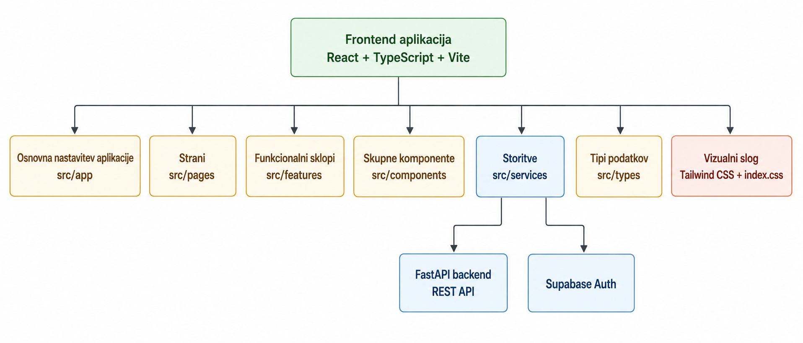
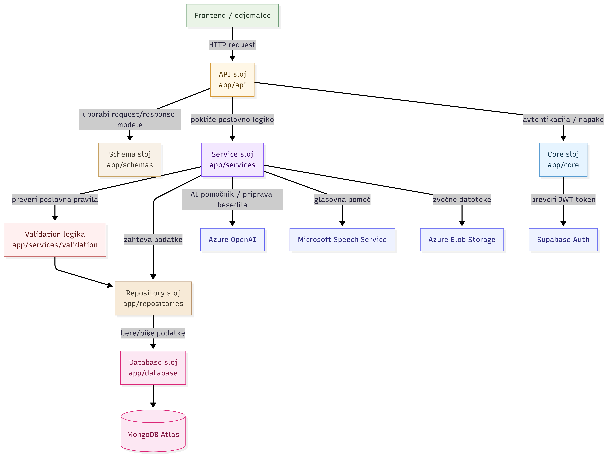
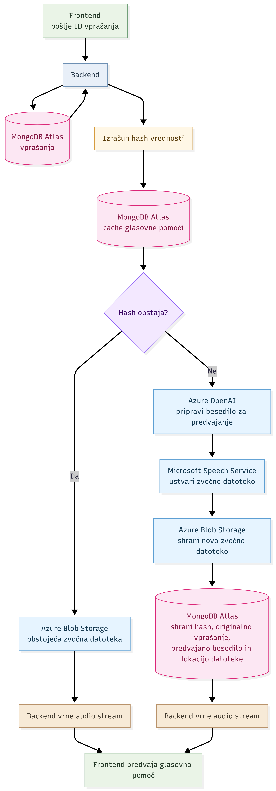
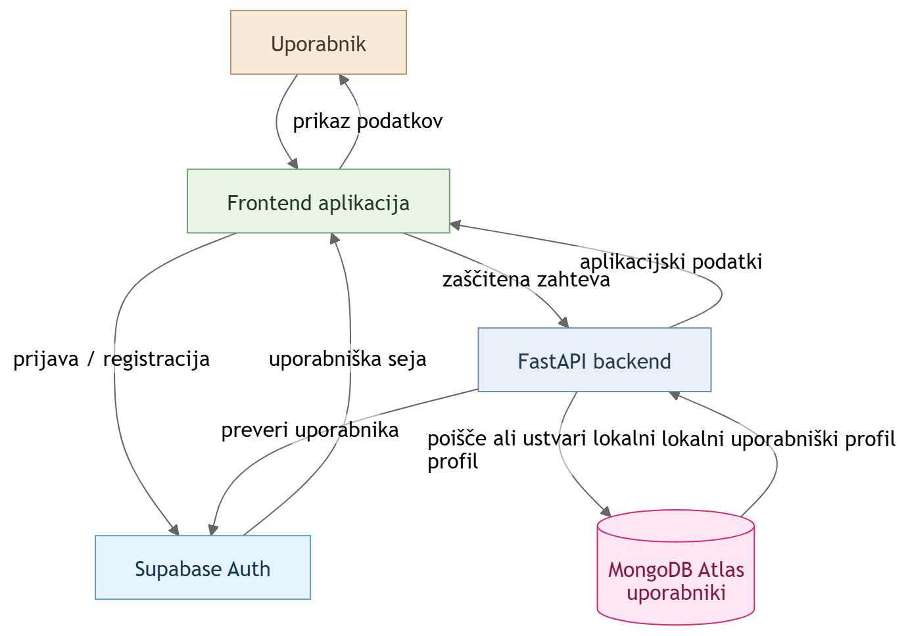

# Arhitektura sistema

Ta dokument opisuje arhitekturo sistema **NIDiKo**. Namen dokumenta je prikazati glavne dele sistema, njihove odgovornosti in način povezovanja med frontend aplikacijo, backend aplikacijo, podatkovno bazo, avtentikacijo ter zunanjimi storitvami.

---

## Kazalo

* [1. Pregled arhitekture sistema](#1-pregled-arhitekture-sistema)
* [2. Arhitektura frontenda](#2-arhitektura-frontenda)
* [3. Arhitektura backenda](#3-arhitektura-backenda)
* [4. Glasovna pomoč](#4-glasovna-pomoč)
* [5. Tok avtentikacije](#5-tok-avtentikacije)
* [6. Povezani dokumenti](#6-povezani-dokumenti)

---

## 1. Pregled arhitekture sistema

NIDiKo je sestavljen iz več glavnih delov:

* **React frontend**, ki predstavlja uporabniški vmesnik,
* **FastAPI backend**, ki izvaja poslovno logiko in izpostavlja REST API endpoint-e,
* **MongoDB Atlas**, kjer so shranjeni podatki aplikacije,
* **Supabase Auth**, ki skrbi za avtentikacijo uporabnikov,
* **Microsoft Azure storitve**, ki omogočajo AI pomočnika, glasovno pomoč in shranjevanje zvočnih datotek.

Frontend z backendom komunicira prek REST API endpointov. Backend je osrednji del sistema, saj povezuje podatkovno bazo, avtentikacijo, priporočilno logiko, vprašalnike, uporabniški napredek in zunanje storitve.


---

## 2. Arhitektura frontenda

Frontend je zgrajen z uporabo **React**, **TypeScript**, **Vite** in **Tailwind CSS**.

Njegova glavna naloga je uporabniku omogočiti pregleden in odziven vmesnik za:

* pregled učnih poti, modulov in učnih enot,
* iskanje vsebin,
* izpolnjevanje vprašalnika,
* prikaz rezultatov samoocene,
* uporabo AI pomočnika,
* uporabo glasovne pomoči,
* prijavo in upravljanje uporabniškega profila,
* spremljanje napredka.

Frontend je organiziran po odgovornostih:



Diagram prikazuje modularno strukturo frontend aplikacije. Frontend je razdeljen na osnovno nastavitev aplikacije, strani, funkcionalne sklope, skupne komponente, storitve, tipe podatkov in vizualni slog.

Pomembno pravilo frontend arhitekture je, da komunikacija z backendom poteka prek sloja `services`. Komponente in strani ne kličejo backend API endpointov neposredno, ampak uporabljajo ustrezne service datoteke. S tem je komunikacija z backendom ločena od prikazne logike in jo je lažje vzdrževati.

Frontend je povezan tudi z zunanjim sistemom **Supabase Auth**, ki se uporablja za prijavo, registracijo, upravljanje uporabniške seje in pridobitev JWT tokena. Pri zaščitenih zahtevah frontend token pošlje backendu, backend pa ga preveri in uporabnika poveže z lokalnim profilom v MongoDB.


---

## 3. Arhitektura backenda

Backend je zgrajen z uporabo **Python**, **FastAPI**, **Pydantic** in **MongoDB**.

Backend uporablja plastno arhitekturo. Pomen slojev:

* `app/api` vsebuje FastAPI endpoint-e,
* `app/services` vsebuje poslovno logiko,
* `app/repositories` vsebuje dostop do MongoDB,
* `app/schemas` vsebuje Pydantic request/response modele,
* `app/core` vsebuje varnostno in skupno backend logiko,
* `app/database` vsebuje povezavo s podatkovno bazo.

Glavno pravilo backend arhitekture je, da vsak sloj opravlja svojo odgovornost:



Diagram prikazuje večplastno arhitekturo backenda in njegove glavne povezave z zunanjimi sistemi. Zahteva iz frontenda najprej pride v API sloj, kjer so definirani FastAPI endpointi. API sloj uporablja Pydantic sheme za vhodne in izhodne podatke ter poslovno logiko preda service sloju.

Service sloj vsebuje glavno poslovno logiko aplikacije. Po potrebi uporablja validacijsko logiko in repository sloj. Repository sloj je odgovoren za dostop do podatkov in prek database sloja komunicira z MongoDB Atlas.

Core sloj vsebuje skupno logiko, kot sta avtentikacija in obravnava napak. Za preverjanje JWT tokenov sodeluje s Supabase Auth. Service sloj se povezuje tudi z zunanjimi Microsoft Azure storitvami, ki podpirajo AI pomočnika, glasovno pomoč in shranjevanje zvočnih datotek.

---

## 4. Glasovna pomoč

Glasovna pomoč je posebna funkcionalnost sistema, namenjena bolj dostopnemu izpolnjevanju vprašalnika.

Pri predpomnjenju se shrani tako originalno vprašanje iz vprašalnika kot tudi besedilo, ki je bilo dejansko predvajano uporabniku.

<p align="center">
  
</p>


Več o arhitekturni odločitvi za predpomnjenje glasovne pomoči je zapisano v dokumentu:

- [ADR-009: Uporaba predpomnjenja za glasovno pomoč](adr/ADR-009-uporaba-predpomnjenja-za-glasovno-pomoc.md)

---

## 5. Tok avtentikacije

Aplikacija uporablja **Supabase Auth** za avtentikacijo uporabnikov.

Sistem loči dve ravni uporabnika:

```text
Supabase auth_user_id  → zunanji auth uporabnik
MongoDB user_id        → lokalni uporabnik aplikacije
```

Ta ločitev omogoča, da Supabase upravlja prijavo in seje, MongoDB pa hrani aplikacijske podatke, kot so uporabniški profil, shranjene vsebine, priljubljene vsebine, dokončane vsebine in trenutna pozicija uporabnika.




Več o tej arhitekturni odločitvi je zapisano v dokumentu:

* [ADR-010: Uporaba Supabase Auth](adr/ADR-010-uporaba-supabase-auth-za-avtentikacijo.md)

---

## 6. Povezani dokumenti

* [Krovni README](../README.md)
* [Frontend README](../frontend/README.md)
* [Backend README](../backend/README.md)
* [Tehnološki sklad](02-tehnoloski-sklad.md)
* [Podatkovni model](05-podatkovni-model.md)
* [API endpointi](06-api-endpointi.md)
* [Uporabniški tokovi](07-uporabniski-tokovi.md)
* [Logika vprašalnika](14-logika-vprasalnika.md)
* [ADR-009: Uporaba predpomnjenja za glasovno pomoč](adr/ADR-009-uporaba-predpomnjenja-za-glasovno-pomoc.md)
* [ADR-010: Uporaba Supabase Auth](adr/ADR-010-uporaba-supabase-auth-za-avtentikacijo.md)
