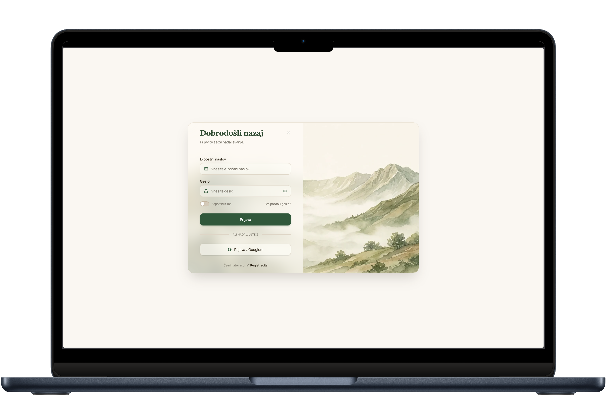
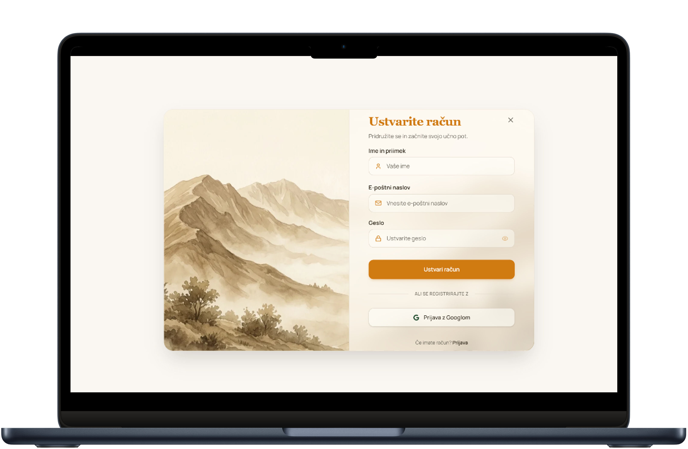
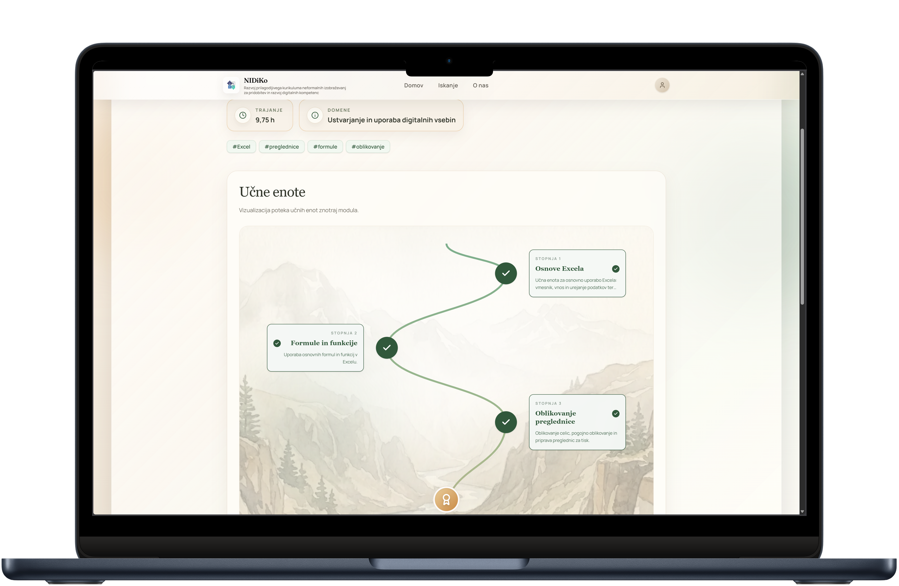
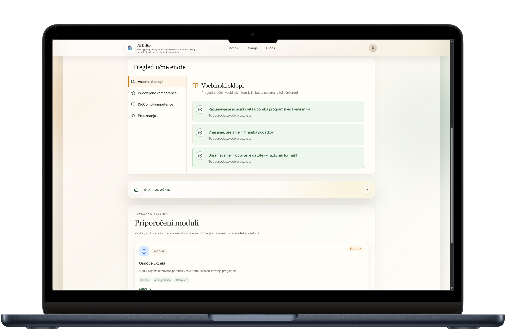
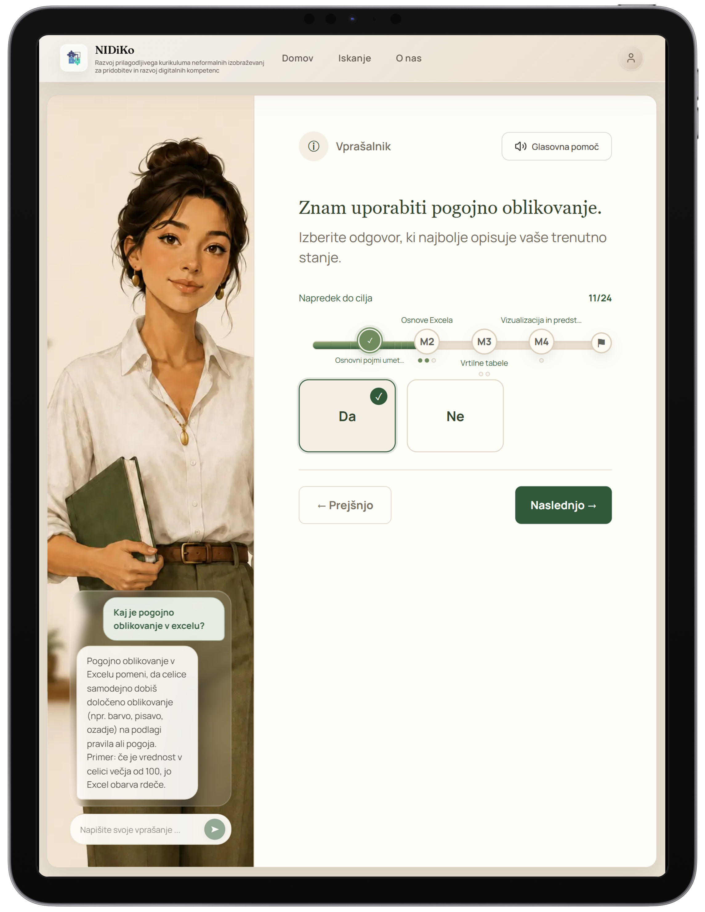

# Zaslonski prikazi

Ta dokument vsebuje reprezentativne zaslonske prikaze aplikacije **NIDiKo**.

Namen dokumenta je prikazati glavne dele uporabniškega vmesnika na namiznem, tabličnem in mobilnem prikazu.

---

## 1. Začetna stran

Začetna stran uporabniku predstavi namen aplikacije in omogoča začetek raziskovanja učnih vsebin.

### Namizni prikaz

### Tablični prikaz

### Mobilni prikaz

---

## 2. Iskanje

Iskanje uporabniku omogoča hitro odkrivanje učnih poti, modulov in učnih enot.

### Namizni prikaz

### Tablični prikaz

### Mobilni prikaz

---

## 3. Stran O nas

Stran »O nas« predstavi projekt, namen aplikacije in širši kontekst razvoja digitalnih kompetenc.

### Namizni prikaz

### Tablični prikaz

### Mobilni prikaz

---

## 4. Prijava in registracija

Prijava in registracija omogočata uporabniku dostop do osebnih funkcionalnosti, kot so shranjevanje vsebin, priljubljene vsebine, dokončane vsebine in spremljanje napredka.

### Prijava

### Registracija

---

## 5. Stran podrobnosti učne poti

Stran podrobnosti učne poti prikazuje opis učne poti, njeno strukturo, povezane module ali učne enote ter akcije za prijavljenega uporabnika.

### Namizni prikaz

### Tablični prikaz

### Mobilni prikaz

---

## 6. Stran podrobnosti modula

Stran podrobnosti modula prikazuje opis modula, povezane učne enote in napredek znotraj modula.

### Namizni prikaz

### Tablični prikaz

### Mobilni prikaz

---

## 7. Stran podrobnosti učne enote

Stran podrobnosti učne enote prikazuje opis, teme, kompetence, podatke o izvedbi in dodatno podporo uporabniku.

### Namizni prikaz

### Tablični prikaz

### Mobilni prikaz

---

## 8. Vprašalnik

Vprašalnik uporabniku omogoča samooceno trenutnega znanja. Trenutno temelji na vprašanjih tipa DA/NE.

### Namizni prikaz

### Tablični prikaz

### Mobilni prikaz

---

## 9. Rezultat vprašalnika

Rezultat vprašalnika uporabniku pokaže priporočeno začetno točko oziroma naslednji korak.

### Namizni prikaz

### Tablični prikaz

### Mobilni prikaz

---

## 10. AI pomočnik

AI pomočnik uporabniku pomaga razumeti učno vsebino ali vprašanje v vprašalniku.

### AI pomočnik na strani podrobnosti

### AI pomočnik pri vprašalniku

